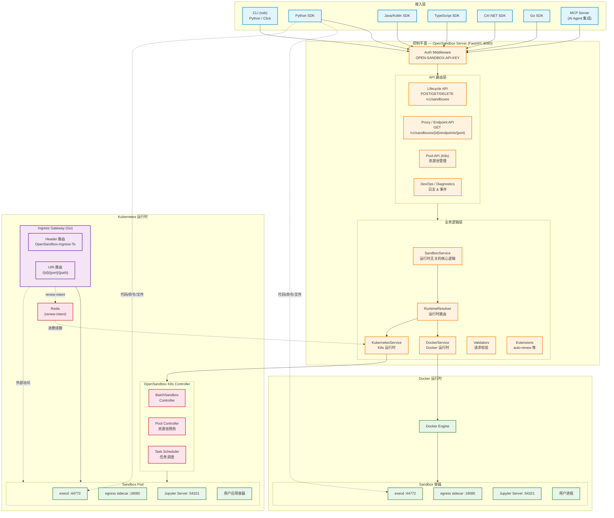
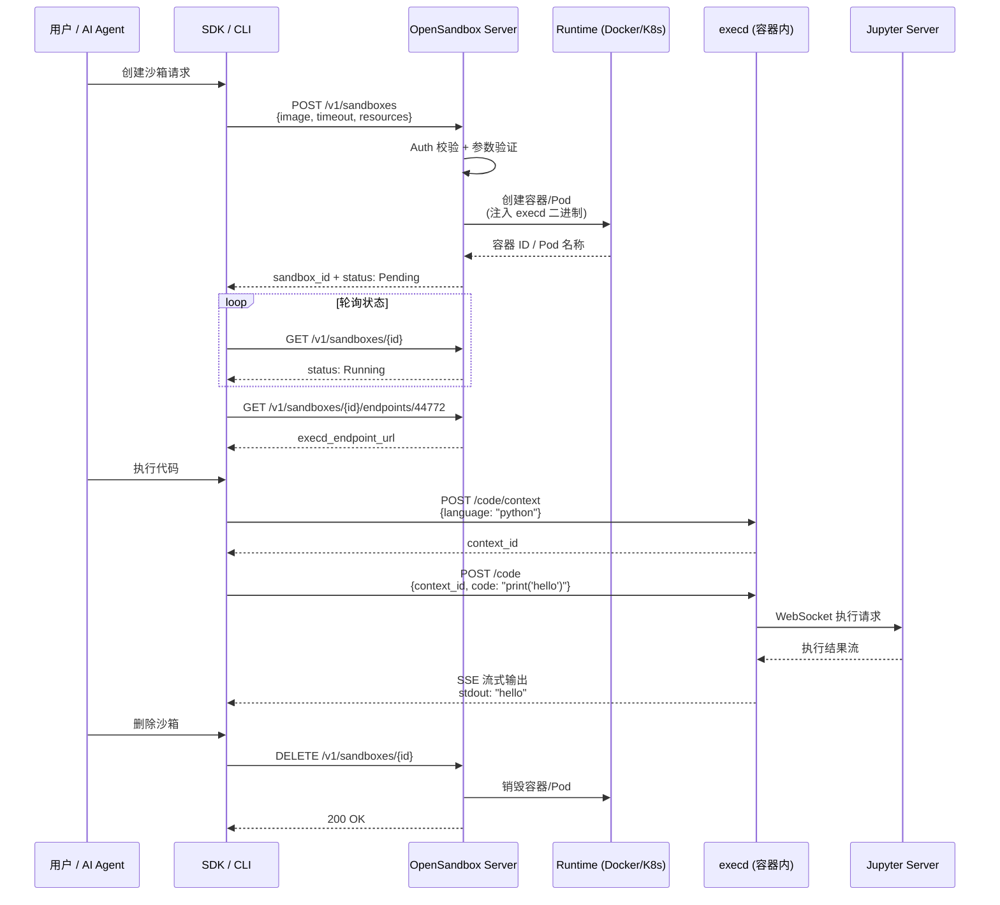
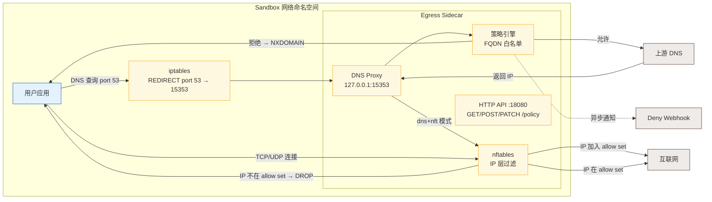
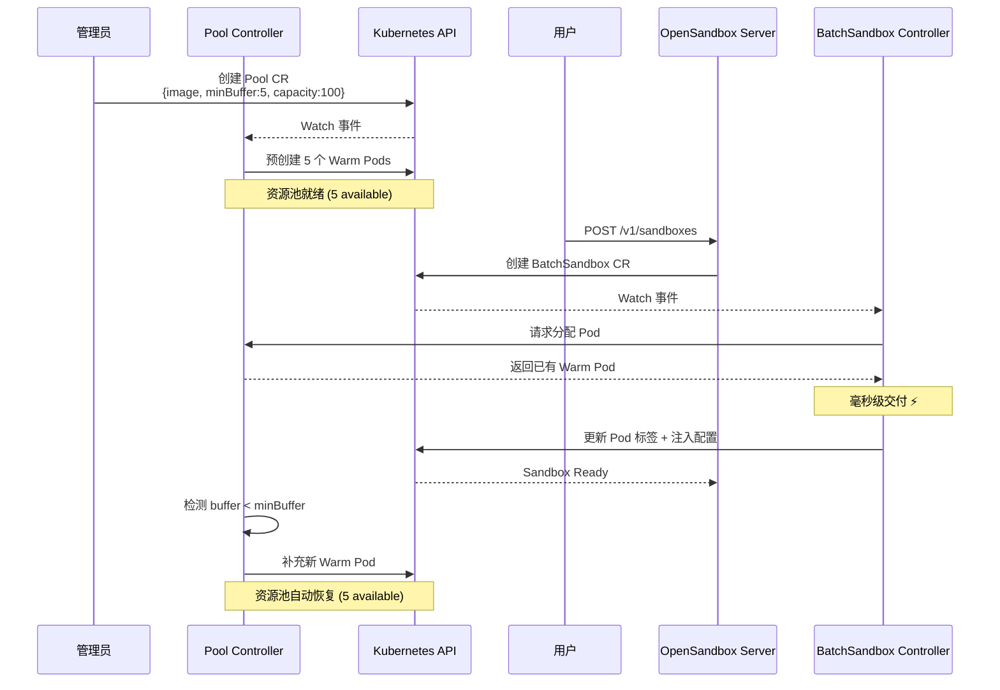
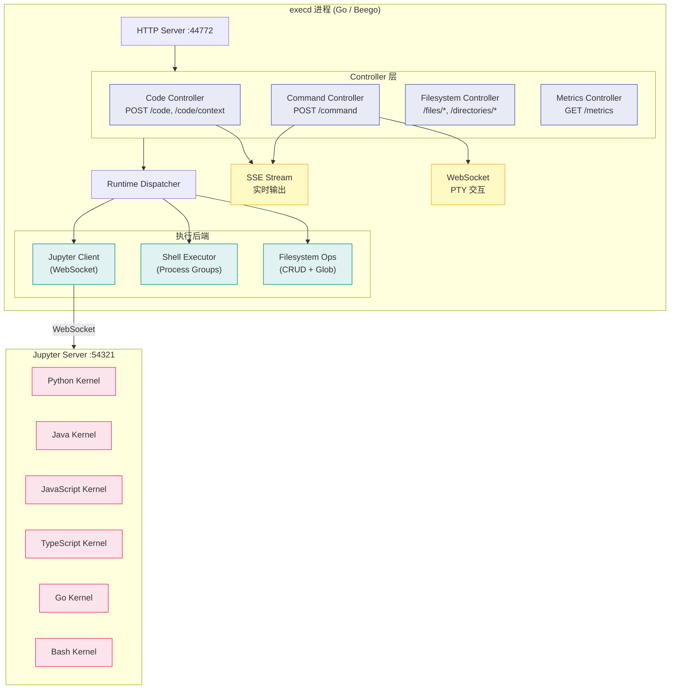
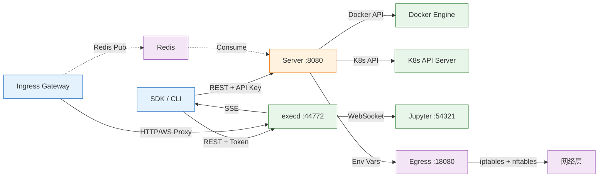

# OpenSandbox 架构图

## 系统全局架构

```mermaid
graph TB
    subgraph Clients["接入层"]
        CLI["CLI (osb)<br/>Python / Click"]
        SDK_PY["Python SDK"]
        SDK_JAVA["Java/Kotlin SDK"]
        SDK_TS["TypeScript SDK"]
        SDK_CS["C#/.NET SDK"]
        SDK_GO["Go SDK"]
        MCP["MCP Server<br/>(AI Agent 集成)"]
    end

    subgraph Server["控制平面 — OpenSandbox Server (FastAPI :8080)"]
        direction TB
        AUTH["Auth Middleware<br/>OPEN-SANDBOX-API-KEY"]
        subgraph API["API 路由层"]
            LIFECYCLE["Lifecycle API<br/>POST/GET/DELETE /v1/sandboxes"]
            PROXY["Proxy / Endpoint API<br/>GET /v1/sandboxes/{id}/endpoints/{port}"]
            POOL_API["Pool API (K8s)<br/>资源池管理"]
            DEVOPS["DevOps / Diagnostics<br/>日志 & 事件"]
        end
        subgraph Services["业务逻辑层"]
            SANDBOX_SVC["SandboxService<br/>运行时无关的核心逻辑"]
            RESOLVER["RuntimeResolver<br/>运行时路由"]
            DOCKER_SVC["DockerService<br/>Docker 运行时"]
            K8S_SVC["KubernetesService<br/>K8s 运行时"]
            VALIDATORS["Validators<br/>请求校验"]
            EXT["Extensions<br/>auto-renew 等"]
        end
        AUTH --> API
        API --> Services
        SANDBOX_SVC --> RESOLVER
        RESOLVER --> DOCKER_SVC
        RESOLVER --> K8S_SVC
    end

    subgraph DockerRT["Docker 运行时"]
        DOCKER_ENGINE["Docker Engine"]
        subgraph DockerSandbox["Sandbox 容器"]
            D_EXECD["execd :44772"]
            D_EGRESS["egress sidecar :18080"]
            D_JUPYTER["Jupyter Server :54321"]
            D_APP["用户进程"]
        end
        DOCKER_ENGINE --> DockerSandbox
    end

    subgraph K8sRT["Kubernetes 运行时"]
        subgraph Controller["OpenSandbox K8s Controller"]
            BS_CTRL["BatchSandbox<br/>Controller"]
            POOL_CTRL["Pool Controller<br/>资源池预热"]
            TASK_SCHED["Task Scheduler<br/>任务调度"]
        end
        subgraph K8sPod["Sandbox Pod"]
            K_EXECD["execd :44772"]
            K_EGRESS["egress sidecar :18080"]
            K_JUPYTER["Jupyter Server :54321"]
            K_APP["用户应用容器"]
        end
        subgraph Ingress["Ingress Gateway (Go)"]
            HEADER_MODE["Header 路由<br/>OpenSandbox-Ingress-To"]
            URI_MODE["URI 路由<br/>/{id}/{port}/{path}"]
        end
        REDIS["Redis<br/>(renew-intent)"]
        Controller --> K8sPod
        Ingress --> K8sPod
        Ingress -.->|renew-intent| REDIS
        REDIS -.->|消费续期| K8S_SVC
    end

    %% 接入层连接
    CLI --> AUTH
    SDK_PY --> AUTH
    SDK_JAVA --> AUTH
    SDK_TS --> AUTH
    SDK_CS --> AUTH
    SDK_GO --> AUTH
    MCP --> AUTH

    %% Server 到运行时
    DOCKER_SVC --> DOCKER_ENGINE
    K8S_SVC --> Controller

    %% SDK 直连 execd
    SDK_PY -.->|代码/命令/文件| D_EXECD
    SDK_PY -.->|代码/命令/文件| K_EXECD

    %% 外部流量
    Ingress -.->|外部访问| K8sPod

    classDef client fill:#e1f5fe,stroke:#0288d1,stroke-width:2px
    classDef server fill:#fff3e0,stroke:#f57c00,stroke-width:2px
    classDef runtime fill:#e8f5e9,stroke:#388e3c,stroke-width:2px
    classDef network fill:#f3e5f5,stroke:#7b1fa2,stroke-width:2px
    classDef infra fill:#fce4ec,stroke:#c62828,stroke-width:2px

    class CLI,SDK_PY,SDK_JAVA,SDK_TS,SDK_CS,SDK_GO,MCP client
    class AUTH,LIFECYCLE,PROXY,POOL_API,DEVOPS,SANDBOX_SVC,RESOLVER,DOCKER_SVC,K8S_SVC,VALIDATORS,EXT server
    class D_EXECD,D_EGRESS,D_JUPYTER,D_APP,K_EXECD,K_EGRESS,K_JUPYTER,K_APP,DOCKER_ENGINE runtime
    class HEADER_MODE,URI_MODE,Ingress network
    class BS_CTRL,POOL_CTRL,TASK_SCHED,REDIS infra
```

## 沙箱创建与执行流程

```mermaid
sequenceDiagram
    participant User as 用户 / AI Agent
    participant SDK as SDK / CLI
    participant Server as OpenSandbox Server
    participant RT as Runtime (Docker/K8s)
    participant Execd as execd (容器内)
    participant Jupyter as Jupyter Server

    User->>SDK: 创建沙箱请求
    SDK->>Server: POST /v1/sandboxes<br/>{image, timeout, resources}
    Server->>Server: Auth 校验 + 参数验证
    Server->>RT: 创建容器/Pod<br/>(注入 execd 二进制)
    RT-->>Server: 容器 ID / Pod 名称
    Server-->>SDK: sandbox_id + status: Pending

    loop 轮询状态
        SDK->>Server: GET /v1/sandboxes/{id}
        Server-->>SDK: status: Running
    end

    SDK->>Server: GET /v1/sandboxes/{id}/endpoints/44772
    Server-->>SDK: execd_endpoint_url

    User->>SDK: 执行代码
    SDK->>Execd: POST /code/context<br/>{language: "python"}
    Execd-->>SDK: context_id

    SDK->>Execd: POST /code<br/>{context_id, code: "print('hello')"}
    Execd->>Jupyter: WebSocket 执行请求
    Jupyter-->>Execd: 执行结果流
    Execd-->>SDK: SSE 流式输出<br/>stdout: "hello"

    User->>SDK: 删除沙箱
    SDK->>Server: DELETE /v1/sandboxes/{id}
    Server->>RT: 销毁容器/Pod
    Server-->>SDK: 200 OK
```

## 网络流量控制架构

```mermaid
graph LR
    subgraph SandboxNS["Sandbox 网络命名空间"]
        APP["用户应用"]
        subgraph EgressProxy["Egress Sidecar"]
            DNS_PROXY["DNS Proxy<br/>127.0.0.1:15353"]
            POLICY["策略引擎<br/>FQDN 白名单"]
            NFT["nftables<br/>IP 层过滤"]
            POLICY_API["HTTP API :18080<br/>GET/POST/PATCH /policy"]
        end
        IPTABLES["iptables<br/>REDIRECT port 53 → 15353"]
    end

    UPSTREAM_DNS["上游 DNS"]
    INTERNET["互联网"]
    WEBHOOK["Deny Webhook"]

    APP -->|DNS 查询 port 53| IPTABLES
    IPTABLES --> DNS_PROXY
    DNS_PROXY --> POLICY

    POLICY -->|允许| UPSTREAM_DNS
    UPSTREAM_DNS -->|返回 IP| DNS_PROXY
    DNS_PROXY -->|dns+nft 模式| NFT
    NFT -->|IP 加入 allow set| INTERNET

    POLICY -->|拒绝 → NXDOMAIN| APP
    POLICY -.->|异步通知| WEBHOOK

    APP -->|TCP/UDP 连接| NFT
    NFT -->|IP 在 allow set| INTERNET
    NFT -->|IP 不在 allow set → DROP| APP

    classDef app fill:#e3f2fd,stroke:#1565c0
    classDef egress fill:#fff8e1,stroke:#f9a825
    classDef external fill:#efebe9,stroke:#5d4037

    class APP app
    class DNS_PROXY,POLICY,NFT,POLICY_API,IPTABLES egress
    class UPSTREAM_DNS,INTERNET,WEBHOOK external
```

## Kubernetes 资源池快速交付流程

```mermaid
sequenceDiagram
    participant Admin as 管理员
    participant PoolCtrl as Pool Controller
    participant K8s as Kubernetes API
    participant User as 用户
    participant Server as OpenSandbox Server
    participant BSCtrl as BatchSandbox Controller

    Admin->>K8s: 创建 Pool CR<br/>{image, minBuffer:5, capacity:100}
    K8s-->>PoolCtrl: Watch 事件
    PoolCtrl->>K8s: 预创建 5 个 Warm Pods
    Note over PoolCtrl,K8s: 资源池就绪 (5 available)

    User->>Server: POST /v1/sandboxes
    Server->>K8s: 创建 BatchSandbox CR
    K8s-->>BSCtrl: Watch 事件
    BSCtrl->>PoolCtrl: 请求分配 Pod
    PoolCtrl-->>BSCtrl: 返回已有 Warm Pod
    Note over BSCtrl: 毫秒级交付 ⚡
    BSCtrl->>K8s: 更新 Pod 标签 + 注入配置
    K8s-->>Server: Sandbox Ready

    PoolCtrl->>PoolCtrl: 检测 buffer < minBuffer
    PoolCtrl->>K8s: 补充新 Warm Pod
    Note over PoolCtrl,K8s: 资源池自动恢复 (5 available)
```

## execd 内部架构

```mermaid
graph TB
    subgraph ExecdProcess["execd 进程 (Go / Beego)"]
        HTTP["HTTP Server :44772"]
        subgraph Controllers["Controller 层"]
            CODE_CTRL["Code Controller<br/>POST /code, /code/context"]
            CMD_CTRL["Command Controller<br/>POST /command"]
            FS_CTRL["Filesystem Controller<br/>/files/*, /directories/*"]
            METRICS_CTRL["Metrics Controller<br/>GET /metrics"]
        end
        RUNTIME["Runtime Dispatcher"]
        subgraph Backends["执行后端"]
            JUPYTER_CLIENT["Jupyter Client<br/>(WebSocket)"]
            SHELL_EXEC["Shell Executor<br/>(Process Groups)"]
            FS_OPS["Filesystem Ops<br/>(CRUD + Glob)"]
        end
        SSE["SSE Stream<br/>实时输出"]
        WS["WebSocket<br/>PTY 交互"]
    end

    subgraph JupyterServer["Jupyter Server :54321"]
        PY_KERNEL["Python Kernel"]
        JAVA_KERNEL["Java Kernel"]
        JS_KERNEL["JavaScript Kernel"]
        TS_KERNEL["TypeScript Kernel"]
        GO_KERNEL["Go Kernel"]
        BASH_KERNEL["Bash Kernel"]
    end

    HTTP --> Controllers
    Controllers --> RUNTIME
    RUNTIME --> JUPYTER_CLIENT
    RUNTIME --> SHELL_EXEC
    RUNTIME --> FS_OPS
    JUPYTER_CLIENT -->|WebSocket| JupyterServer
    CODE_CTRL --> SSE
    CMD_CTRL --> SSE
    CMD_CTRL --> WS

    classDef ctrl fill:#e8eaf6,stroke:#3f51b5
    classDef backend fill:#e0f2f1,stroke:#00897b
    classDef kernel fill:#fce4ec,stroke:#e91e63
    classDef stream fill:#fff9c4,stroke:#f9a825

    class CODE_CTRL,CMD_CTRL,FS_CTRL,METRICS_CTRL ctrl
    class JUPYTER_CLIENT,SHELL_EXEC,FS_OPS backend
    class PY_KERNEL,JAVA_KERNEL,JS_KERNEL,TS_KERNEL,GO_KERNEL,BASH_KERNEL kernel
    class SSE,WS stream
```

## 组件通信协议总览

```mermaid
graph LR
    SDK["SDK / CLI"] -->|REST + API Key| Server["Server :8080"]
    Server -->|Docker API| Docker["Docker Engine"]
    Server -->|K8s API| K8s["K8s API Server"]
    SDK -->|REST + Token| Execd["execd :44772"]
    Execd -->|WebSocket| Jupyter["Jupyter :54321"]
    Execd -->|SSE| SDK
    Ingress["Ingress Gateway"] -->|HTTP/WS Proxy| Execd
    Ingress -.->|Redis Pub| Redis["Redis"]
    Redis -.->|Consume| Server
    Server -->|Env Vars| Egress["Egress :18080"]
    Egress -->|iptables + nftables| Network["网络层"]

    classDef blue fill:#e3f2fd,stroke:#1565c0
    classDef orange fill:#fff3e0,stroke:#ef6c00
    classDef green fill:#e8f5e9,stroke:#2e7d32
    classDef purple fill:#f3e5f5,stroke:#7b1fa2

    class SDK,Ingress blue
    class Server orange
    class Execd,Jupyter,Docker,K8s green
    class Egress,Redis,Network purple
```
